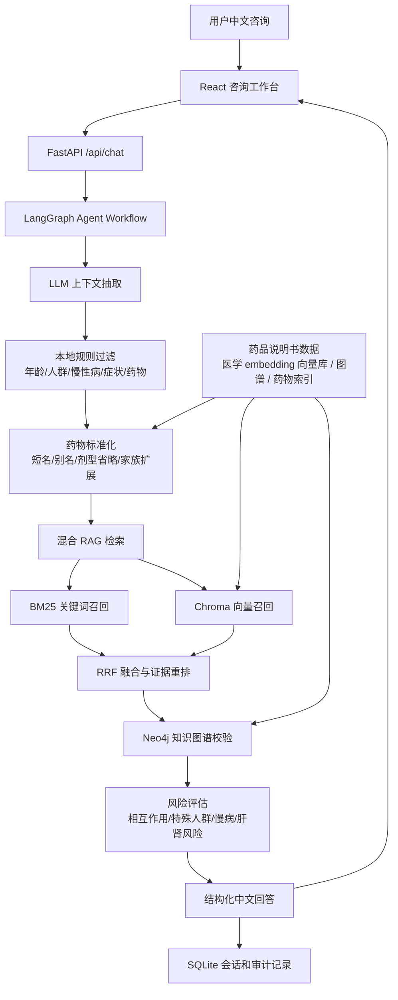

# SafeMeds Consult

> 中文用药安全咨询 Agent：基于 LLM 上下文抽取、药物标准化、Chroma RAG、Neo4j 知识图谱和 LangGraph 工作流，生成可追溯、有证据边界的用药风险提示。

[](https://www.python.org/)
[](https://fastapi.tiangolo.com/)
[](https://react.dev/)
[](https://neo4j.com/)
[](https://www.trychroma.com/)

SafeMeds Consult 是一个面向中文用药安全咨询的 RAG Agent 系统，覆盖药品说明书知识构建、药物名称标准化、医学 embedding 语义召回、BM25 关键词召回、Neo4j 知识图谱校验和 LangGraph 工作流编排。系统能够识别药品、年龄、特殊人群、慢性病症状等咨询上下文，优先检索禁忌、注意事项、药物相互作用和特殊人群用药证据，并生成带风险等级、置信度、参考依据和安全边界的中文咨询回复。

## 功能特性

- **LLM 优先的咨询上下文抽取**：可接入兼容的 LLM API，抽取年龄、性别、孕妇/儿童/老人等特殊人群、慢性病、症状和药品名。
- **本地规则过滤与药物标准化**：LLM 只负责理解自然语言，本地索引负责药品名校验、别名映射、盐酸/复方/剂型省略处理和候选制剂扩展。
- **非完整药名家族聚合**：用户只说“布洛芬”“二甲双胍”“感冒灵”时，会按知识库中相关制剂整体判断风险，而不是默认要求补充完整剂型。
- **特殊人群风险召回**：针对孕妇、备孕、哺乳期、儿童、老年人等场景检索说明书警告、禁忌和注意事项。
- **慢性病风险提示**：对糖尿病、高血压等常见慢性病场景，结合药物肝肾毒性、禁忌和注意事项证据给出警告级提示。
- **药物相互作用校验**：同时利用说明书 RAG 证据和 Neo4j 知识图谱关系检查联用风险。
- **Chroma + BM25 混合检索**：语义召回覆盖口语问法，关键词召回保证药名、章节和风险词命中，再进行融合与重排。
- **LangGraph 工作流编排**：把药物识别、RAG 检索、知识图谱校验、风险评估和报告生成拆成可追踪阶段。
- **全栈可运行界面**：FastAPI 后端、React/Vite 前端、SQLite 历史会话、Neo4j Browser 和 Docker Compose 一体化运行。
- **安全边界内置**：证据不足时降级提示补充信息；系统始终声明不提供诊断、处方或替代医生/药师建议。

## 系统架构



## 技术栈

| 层级        | 技术                                                          | 说明                             |
| --------- | ----------------------------------------------------------- | ------------------------------ |
| 前端        | React 19、Vite、Lucide React                                  | 中文咨询工作台、历史记录、证据和系统状态展示         |
| 后端        | FastAPI、Pydantic                                            | API 服务、Schema 校验、异常处理          |
| 工作流       | LangGraph                                                   | 咨询链路阶段化编排和 `workflow_trace` 追踪 |
| LLM       | Your LLM model / compatible API                             | 自然语言上下文抽取和可选回答生成               |
| 检索        | Chroma、BM25、RRF                                             | 向量召回、关键词召回、融合重排                |
| Embedding | sentence-transformers、lastmass/Qwen3-Embedding-Medical-0.6B | 可替换医学 embedding 模型，用于说明书语义向量召回 |
| 图谱        | Neo4j 5.x                                                   | 药物相互作用、禁忌、特殊人群和风险关系校验          |
| 存储        | SQLite、本地 JSON/JSONL                                        | 咨询历史、结构化知识、构建报告                |
| 数据处理      | 结构化解析、文本解析、知识抽取脚本                                           | 说明书知识构建、图谱候选抽取和检索索引构建          |

## 快速开始

### 1. 克隆项目

```bash
git clone https://github.com/<your-org>/safemeds-consult.git
cd safemeds-consult
```

### 2. 准备环境变量

```bash
cp .env.example .env
```

至少检查这些配置：

```bash
SAFEMEDS_DATA_PATH=backend/data/processed/your-drug-knowledge.json
DRUG_RESOLUTION_INDEX_PATH=backend/data/processed/drug_resolution_index.json
VECTOR_BACKEND=chroma
CHROMA_PERSIST_DIR=backend/storage/chroma

LLM_BASE_URL=https://your-llm-api-base-url
LLM_API_KEY=your-llm-api-key
LLM_MODEL=your-llm-model
LLM_ENABLE_EXTRACTION=true
```

如果暂时不接 LLM，也可以设置：

```bash
LLM_ENABLE_EXTRACTION=false
LLM_ENABLE_RESPONSE_GENERATION=false
```

此时系统会回退到本地规则抽取。

### 3. Docker Compose 启动

```bash
docker compose up --build
```

服务地址：

| 服务            | 地址                                       |
| ------------- | ---------------------------------------- |
| 前端工作台         | http://127.0.0.1:5173                    |
| 后端健康检查        | http://127.0.0.1:8000/api/system/health  |
| 系统指标          | http://127.0.0.1:8000/api/system/metrics |
| Neo4j Browser | http://127.0.0.1:7474                    |

Neo4j 默认账号：

```text
user: neo4j
password: safemeds-password
```

Docker 环境默认使用轻量化配置，便于快速启动完整链路。本地开发环境可替换为医学 embedding 模型构建更完整的 Chroma 向量库。

## 本地开发

### 后端

```bash
python3 -m venv backend/.venv
backend/.venv/bin/pip install -r backend/requirements.txt

PYTHONPATH=backend backend/.venv/bin/uvicorn app.main:app \
  --host 127.0.0.1 \
  --port 8000 \
  --reload
```

### 前端

```bash
cd frontend
npm install
npm run dev
```

前端默认代理到 `http://127.0.0.1:8000`。

### Neo4j

可以只启动 Neo4j：

```bash
docker compose up neo4j
```

然后导入图谱：

```bash
PYTHONPATH=backend backend/.venv/bin/python backend/scripts/import_neo4j_kg.py --reset
```

## 数据构建

项目支持从中文药品说明书资料构建三类核心资产：

- `drug_knowledge.json`：RAG 使用的结构化说明书知识库
- `drug_resolution_index.json`：药物标准化索引，支持短名、别名、盐酸前缀和剂型省略
- `instruction_kg_candidates.jsonl`：Neo4j 使用的知识图谱候选关系

### 一条命令构建

先编辑数据构建配置，把输入路径改为你的说明书资料路径，然后运行构建脚本：

```bash
backend/.venv/bin/python backend/manual_*_pipeline/04_run_all.py### 
```
若有需要10万条药品说明书数据，可联系sososhuo邮箱。

## API 示例

### 咨询接口

```bash
curl -s -X POST http://127.0.0.1:8000/api/chat \
  -H "Content-Type: application/json" \
  -d '{
    "message": "我长期吃华法林，今天发烧想吃布洛芬，可以吗？",
    "user_id": "demo_user"
  }'
```

响应核心字段：

| 字段                  | 说明                                   |
| ------------------- | ------------------------------------ |
| `risk_level`        | 风险等级：`Low`、`Medium`、`High`、`Unknown` |
| `confidence`        | 规则化依据支撑分，不代表真实医学概率                    |
| `extracted_context` | 抽取到的人群、疾病、症状、药物等上下文                  |
| `kg_relations`      | Neo4j 命中的图谱关系                        |
| `evidence`          | RAG 检索证据片段                           |
| `safety_flags`      | 特殊人群、慢病、家族扩展、证据不足等安全提示               |
| `workflow_trace`    | LangGraph 各阶段执行轨迹                    |
| `safety_notice`     | 医疗安全免责声明                             |

### 依据支撑分

`confidence` 是系统内部用于表达“当前结论有多少检索和图谱证据支撑”的工程启发式评分，不代表真实医学风险概率，也不表示用药安全概率。

计算规则：

```text
confidence > 0.82：
命中明确药物-药物相互作用规则，当前固定为 0.88

confidence = 0.32：
风险等级为 Unknown，表示证据不足或药品信息不明确

0.48 ~ 0.82：
基于 RAG 参考依据数量和 Neo4j 图谱关系数量计算：
confidence = min(
  0.48 + min(参考依据数量, 5) × 0.06 + min(KG 关系数量, 5) × 0.03,
  0.82
)
```

其中：

- `参考依据数量` 来自 RAG 返回的说明书证据片段数量；
- `KG 关系数量` 来自 Neo4j 命中的结构化图谱关系数量；
- 普通 RAG/KG 证据型判断最高为 `0.82`；
- 明确相互作用规则命中时高于普通证据型上限，固定为 `0.88`。

### 主要接口

| 方法       | 路径                           | 说明                 |
| -------- | ---------------------------- | ------------------ |
| `GET`    | `/api/system/health`         | 系统健康、知识库、图谱和检索状态   |
| `GET`    | `/api/system/metrics`        | 咨询量、延迟、证据命中、风险等级分布 |
| `POST`   | `/api/chat`                  | 多轮用药咨询             |
| `GET`    | `/api/sessions`              | 查询会话列表             |
| `GET`    | `/api/sessions/{session_id}` | 查询会话详情             |
| `DELETE` | `/api/sessions/{session_id}` | 删除会话               |
| `GET`    | `/api/health`                | 基础分析接口健康检查         |
| `POST`   | `/api/analyze`               | 单次药物风险分析           |
| `GET`    | `/api/history`               | 查询分析历史             |
| `GET`    | `/api/history/{history_id}`  | 查询单条分析历史           |
| `DELETE` | `/api/history/{history_id}`  | 删除单条分析历史           |

## 测试

后端单元测试：

```bash
PYTHONPATH=backend backend/.venv/bin/python -m unittest
```

常用关键测试：

```bash
PYTHONPATH=backend backend/.venv/bin/python -m unittest \
  backend.tests.test_drug_resolution \
  backend.tests.test_consultation_workflow \
  backend.tests.test_drug_recognition \
  backend.tests.test_kg_service \
  backend.tests.test_rag_service
```

前端构建：

```bash
cd frontend
npm run build
```

> 注意：部分测试会加载本地知识库、Chroma 或 Neo4j 配置；如外部服务不可用，知识图谱相关逻辑会按项目设计降级。

## 推荐测试文本

儿童发热场景：

```text
我7岁，发烧了，想吃布洛芬胶囊和感冒清热颗粒，可以吗？
```

儿童联用场景：

```text
我10岁，胃不舒服又发烧，想吃布洛芬胶囊和氢氧化铝片，可以一起吃吗？
```

成人相互作用，非完整药名：

```text
我35岁，长期吃华法林，今天发烧想吃布洛芬，可以吗？
```

成人相互作用，完整药名：

```text
我42岁，长期服用华法林钠片，现在想吃布洛芬缓释胶囊退烧，可以吗？
```

孕期用药场景：

```text
我28岁，怀孕12周，牙疼能不能吃布洛芬片？
```

老年慢病场景：

```text
我70岁，有高血压和糖尿病，长期吃缬沙坦胶囊和盐酸二甲双胍片，现在想吃布洛芬退烧，可以吗？
```

## 目录结构

```text
safemeds-consult/
├── backend/
│   ├── app/
│   │   ├── api/                 # FastAPI 路由
│   │   ├── core/                # 配置和日志
│   │   ├── repositories/        # SQLite 仓储
│   │   ├── schemas/             # Pydantic 数据结构
│   │   └── services/            # RAG、LLM、KG、工作流和药物标准化服务
│   ├── data/
│   │   ├── raw/                 # 人工别名等原始配置
│   │   └── processed/           # 结构化知识库、图谱候选、构建报告
│   ├── manual_*_pipeline/       # 说明书资料到 RAG/KG/药物索引的构建流水线
│   ├── scripts/                 # 数据导入、评估和索引构建脚本
│   ├── storage/                 # Chroma 和 SQLite 本地运行数据
│   └── tests/                   # 后端测试
├── frontend/
│   ├── src/                     # React 咨询工作台
│   └── package.json
├── docker-compose.yml
└── README.md
```

## 环境变量

| 变量                               | 默认值                                                 | 说明             |
| -------------------------------- | --------------------------------------------------- | -------------- |
| `SAFEMEDS_DATA_PATH`             | `backend/data/processed/drug_knowledge_zh.json`     | 药品知识库 JSON 路径  |
| `DRUG_RESOLUTION_INDEX_PATH`     | `backend/data/processed/drug_resolution_index.json` | 药物标准化索引路径      |
| `DRUG_ALIAS_OVERRIDES_PATH`      | `backend/data/raw/drug_alias_overrides.json`        | 人工别名覆盖文件       |
| `SAFEMEDS_STORAGE_DIR`           | `backend/storage`                                   | 本地存储目录         |
| `SAFEMEDS_SQLITE_PATH`           | `backend/storage/safemeds_history.sqlite3`          | 咨询历史 SQLite 路径 |
| `LLM_BASE_URL`                   | `https://your-llm-api-base-url`                     | LLM API 地址     |
| `LLM_API_KEY`                    | `your-llm-api-key`                                  | LLM API Key    |
| `LLM_MODEL`                      | `your-llm-model`                                    | LLM 模型名        |
| `LLM_ENABLE_EXTRACTION`          | `false`                                             | 是否启用 LLM 上下文抽取 |
| `LLM_ENABLE_RESPONSE_GENERATION` | `false`                                             | 是否启用 LLM 回答生成  |
| `VECTOR_BACKEND`                 | `chroma`                                            | 向量检索后端         |
| `CHROMA_PERSIST_DIR`             | `backend/storage/chroma`                            | Chroma 持久化目录   |
| `EMBEDDING_BACKEND`              | `sentence_transformers`                             | embedding 后端   |
| `EMBEDDING_MODEL_NAME`           | `lastmass/Qwen3-Embedding-Medical-0.6B`             | embedding 模型   |
| `NEO4J_URI`                      | `bolt://127.0.0.1:7687`                             | Neo4j Bolt 地址  |
| `NEO4J_USER`                     | `neo4j`                                             | Neo4j 用户名      |
| `NEO4J_PASSWORD`                 | `safemeds-password`                                 | Neo4j 密码       |
| `VITE_API_BASE`                  | `http://127.0.0.1:8000`                             | 前端 API 地址      |

## 医疗安全声明

SafeMeds Consult 用于用药风险信息检索、证据组织和咨询辅助，不提供诊断、处方或替代医生/药师的医疗建议。任何涉及处方药调整、孕妇/儿童/老人等特殊人群、慢性病、肝肾功能异常、过敏史或严重症状的情况，应咨询医生或药师。
