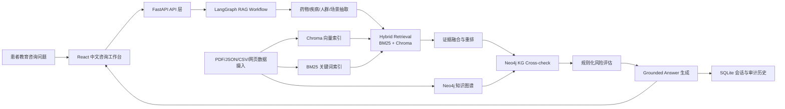

# SafeMeds 中文用药安全 RAG 架构

SafeMeds 是面向患者教育的中文用药安全 RAG 产品原型，聚焦“用药相互作用”和“特殊场景风险”两类问题。系统目标不是替代医生或药师，而是基于药品说明书、指南片段、知识图谱关系和安全规则，生成可追溯、可降级、有边界的用药咨询回答。

项目目标形态：

> 基于 LangGraph、Neo4j 与混合检索的中文用药安全 RAG 产品原型。

## 总体架构



## 核心链路

目标 RAG 流程为：

```text
query
  -> drug/entity extraction
  -> hybrid retrieval
  -> evidence rerank
  -> Neo4j KG cross-check
  -> risk assessment
  -> grounded answer
```

LangGraph 用于编排后端 RAG 状态流，不把产品包装成多 Agent。每个节点是工作流步骤，而不是独立智能体。

## 模块职责

- 前端：中文患者教育咨询工作台，展示风险等级、证据卡片、图谱关系、会话上下文和系统状态。
- FastAPI：提供 `/api/chat`、会话历史、健康检查和 `/api/system/metrics` 系统指标接口。
- LangGraph Workflow：编排实体识别、证据检索、图谱校验、风险评估和回答生成，并在咨询响应中返回 `workflow_trace`。
- Chroma：保存医学语义向量索引，负责 dense retrieval。
- BM25：负责药名、禁忌、剂量、疾病和章节关键词的精确召回。
- RRF + Rerank：融合 BM25 与 Chroma 结果，并按医学章节、药物命中和高风险关键词重排。
- Neo4j：保存药物、药物类别、相互作用、禁忌、特殊人群、检查场景、风险事件和证据来源关系。
- SQLite：保存会话、消息、上下文快照、证据和审计历史。
- LLM：通过 DeepSeek/OpenAI-compatible 接口生成中文表达，只基于结构化结论和证据回答。

## Neo4j 图谱设计

核心节点：

- `Drug`
- `DrugClass`
- `Condition`
- `Scenario`
- `Risk`
- `Source`

核心关系：

- `(Drug)-[:INTERACTS_WITH]->(Drug)`
- `(Drug)-[:CONTRAINDICATED_WITH]->(Drug|DrugClass)`
- `(Drug)-[:BELONGS_TO]->(DrugClass)`
- `(Drug)-[:CAUTION_FOR]->(Condition|Scenario)`
- `(Drug|DrugClass)-[:MAY_CAUSE]->(Risk)`
- 关系属性记录 `risk_level`、`mechanism`、`recommendation`、`source`、`version`、`updated_at`。

## 数据摄入

项目后续需要支持 PDF 为主、JSON/CSV/网页文本混合的数据来源。摄入管线负责：

1. 解析不同格式数据。
2. 清洗文本并按药品、章节、段落切分。
3. 提取药名、别名、章节、来源、版本、页码等元数据。
4. 写入 Chroma/BM25 检索索引。
5. 抽取或导入药物关系到 Neo4j。
6. 输出导入质量报告。

当前已实现 `scripts/ingest_documents.py`，支持 PDF、JSON、CSV、TXT 解析为统一 `DocumentChunk`，并可输出 `document_chunks.json`、`ingestion_report.json` 和当前知识库兼容记录。

## 安全边界

系统必须坚持以下约束：

- 不提供诊断。
- 不替代医生或药师。
- 不建议用户自行调整处方药。
- 证据不足时输出 Unknown 或提示补充信息。
- 高风险或禁忌线索必须提示咨询医生/药师。
- LLM 只能基于已给定证据、图谱关系和风险结论生成回答。

## 系统工程指标

为体现真实产品原型和简历可量化成果，系统应逐步记录：

- API 平均响应时间和 P95 响应时间。
- LLM fallback 成功率。
- Chroma 文档数。
- Neo4j 节点数和关系数。
- 知识库导入成功率。
- 每次回答的证据命中数和 KG 命中数。
- 证据不足降级次数。
- 高风险样例识别通过率。
- 后端测试通过率和前端构建状态。

当前后端已通过内存指标服务记录咨询次数、平均延迟、P95 延迟、证据命中、KG 命中、fallback 率、降级率和风险等级分布；前端工作台已展示系统指标和检索链路。

详细改造计划见 [product_rag_roadmap.md](/Users/shuo/Documents/project/safemeds-agent/docs/product_rag_roadmap.md)。
