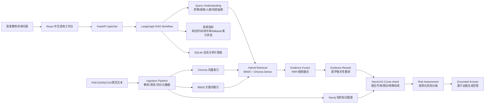

# SafeMeds 架构评审与改造路线图

## 项目定位

SafeMeds 的目标不是做一个泛医疗聊天机器人，也不是强调多 Agent 演示，而是做一个面向患者教育的中文用药安全 RAG 产品原型。核心场景聚焦两类高价值问题：

- 用药相互作用：例如华法林与布洛芬、硝酸甘油与西地那非、辛伐他汀与克拉霉素。
- 特殊场景风险：例如老年人、妊娠/备孕、肾功能不全、增强 CT 前后二甲双胍管理。

项目对外应表达为：

> SafeMeds：基于 LangGraph、Neo4j 与混合检索的中文用药安全 RAG 产品原型。

该定位适合简历展示，也保留真实产品原型的可信度：系统不是替代医生诊断或处方，而是基于说明书、指南片段、知识图谱关系和风险规则，为用户提供可追溯、可降级、有安全边界的患者教育回答。

## 当前架构评估

### 已经合理的部分

- 后端使用 FastAPI + Pydantic，适合结构化接口、风险等级、证据引用和健康检查。
- 前端使用 React + Vite，适合快速构建中文咨询工作台。
- Chroma + 医学 embedding 已经具备语义检索基础，比普通关键词检索更贴近 RAG 项目。
- SQLite 保存会话历史和咨询快照，适合本地原型和审计留痕。
- 当前回答链路已经有药物识别、KG 关系、向量证据、风险评估和 LLM 生成 fallback，医疗安全边界比“直接让大模型回答”更稳。
- 测试覆盖了实体识别、风险评估、RAG、API 和历史记录，对简历项目很有价值。

### 主要短板

- RAG 链路还不完整：当前更接近单路向量检索，缺少关键词召回、结果融合、重排、引用校验和检索质量指标。
- KG 目前是内存邻接表，适合 demo，但不够像真实业务中的知识图谱服务。
- 数据摄入仍以固定 JSON 为主，尚未覆盖 PDF、网页、CSV、结构化表格等混合来源。
- LangGraph 尚未接入，咨询流程虽然清晰，但缺少可观测的 workflow 状态编排。
- 系统工程指标还没有产品化展示，例如响应时间、检索命中率、fallback 次数、索引状态和知识库更新时间。
- README 和架构图仍偏面试 demo 表达，需要重塑为全栈产品原型表达。

## 目标架构

## 目标 RAG 链路

后端主流程应从当前的 service 编排升级为 LangGraph workflow：

1. Query Understanding：识别药物、疾病、特殊人群、风险因素和检查场景。
2. Hybrid Retrieval：同时使用 BM25 关键词检索和 Chroma dense retrieval。
3. Evidence Fusion：使用 RRF 或规则加权融合两路召回结果。
4. Evidence Rerank：使用轻量 reranker 或医学规则重排，把相互作用、禁忌、警告注意事项等章节前置。
5. Neo4j KG Cross-check：查询药物相互作用、禁忌合用、疾病/场景注意事项。
6. Risk Assessment：综合证据、图谱关系和规则输出 High/Medium/Low/Unknown。
7. Grounded Answer：LLM 只负责基于已确定证据和风险结构生成中文表达；证据不足时必须降级或拒绝确定性结论。

这不是多 Agent。LangGraph 在这里用于状态流和可观测 pipeline 编排，而不是把每个节点包装成独立 Agent。

## Neo4j 改造原则

用户已决定不保留 InMemoryKGBackend，正式运行依赖 Neo4j。这样更贴近真实业务，但需要在工程上补齐启动、健康检查和测试策略。

### 图谱核心实体

- `Drug`：标准药物名、别名、ATC/RxNorm/NMPA 编码等。
- `DrugClass`：药物类别，例如 NSAIDs、抗凝药、硝酸酯类。
- `Condition`：疾病或生理状态，例如冠心病、肾功能不全、妊娠/备孕。
- `Scenario`：检查或用药场景，例如增强 CT / 造影剂、术前停药。
- `Risk`：风险事件，例如出血、横纹肌溶解、低血压、乳酸酸中毒。
- `Source`：证据来源，例如说明书、指南、共识、数据集。

### 核心关系

- `(Drug)-[:INTERACTS_WITH]->(Drug)`
- `(Drug)-[:CONTRAINDICATED_WITH]->(Drug|DrugClass)`
- `(Drug)-[:BELONGS_TO]->(DrugClass)`
- `(Drug)-[:CAUTION_FOR]->(Condition|Scenario)`
- `(Drug|DrugClass)-[:MAY_CAUSE]->(Risk)`
- `(Relation)-[:SUPPORTED_BY]->(Source)` 或使用关系属性记录证据来源、版本、风险等级。

### 工程要求

- `docker-compose.yml` 增加 Neo4j 服务，后端通过环境变量读取连接信息。
- 后端启动时检查 Neo4j 连通性，并在 `/api/system/health` 返回 KG 状态。
- 数据导入脚本负责从处理后的知识库生成 Neo4j 节点和关系。
- 单元测试可以 mock Neo4j repository；集成测试使用 Docker Neo4j。

## 混合数据摄入

后续数据会以 PDF 为主，并混合 JSON、CSV 和网页文本。因此需要独立 ingestion pipeline：

1. Source Loader：按来源类型读取 PDF、JSON、CSV、HTML 或纯文本。
2. Text Normalizer：清理页眉页脚、空白、乱码、重复文本和无关声明。
3. Medical Chunker：按药品、章节、段落和语义长度切分。
4. Metadata Extractor：提取药品名、章节、来源、版本、发布日期、页码。
5. KG Extractor：从结构化字段或规则中抽取相互作用、禁忌、适应症、特殊人群注意。
6. Index Writer：写入 Chroma、BM25 索引和 Neo4j。
7. Quality Report：输出导入条数、失败条数、重复率、缺失字段和索引耗时。

PDF 解析建议保留 `pymupdf`，后续可按文档质量增加 OCR 或版面解析能力，但第一阶段不必过度复杂化。

## 系统工程量化指标

简历项目应优先展示系统工程效果，而不是只写“用了 RAG”。建议建立一组可自动统计的指标：

- API 平均响应时间、P95 响应时间。
- LLM 调用失败后的 fallback 成功率。
- Chroma 索引文档数、Neo4j 节点数、关系数。
- 知识库导入成功率和失败原因统计。
- 每次回答的证据命中数、KG 命中数、证据不足降级次数。
- 高风险样例识别通过率，例如固定 20-50 条用药相互作用测试集。
- 后端测试用例数和通过率。
- 前端构建成功率。

简历表达可以写成：

> 构建中文用药安全 RAG 原型，使用 LangGraph 编排 7 阶段 RAG workflow，结合 Chroma 向量检索、BM25 混合召回、Neo4j 药物知识图谱和规则化风险评估，实现证据可追溯的患者教育回答；设计系统指标面板，统计响应时间、索引规模、证据命中、KG 命中、fallback 成功率和高风险样例通过率。

实际数字应在改造和压测后再填写，避免简历中出现无法复现的指标。

## 产品化界面方向

前端应继续保持中文患者教育助手形态，不暴露“多 Agent”概念。建议新增或强化：

- 咨询主界面：输入问题、展示结论、风险等级、安全声明。
- 证据卡片：来源、章节、药物、片段、相关性、是否被 KG 支持。
- 检索链路面板：实体识别、BM25 命中、向量命中、重排后证据、图谱关系。
- 知识库状态页：Chroma 文档数、Neo4j 节点/关系数、最近导入时间、导入错误。
- 会话上下文面板：本轮已识别药物、疾病、特殊人群和风险因素。
- 系统健康面板：后端、LLM、Chroma、Neo4j、SQLite 状态。

措辞上必须坚持患者教育边界：不提供诊断，不替代医生/药师，不建议自行调整处方药。

## 分阶段改造计划

### 第一阶段：项目表达与施工图

- 新增本路线图文档。
- 更新 README 和架构文档，明确项目定位、目标架构和非多 Agent 说明。
- 设计简历项目描述和待量化指标清单。

### 第二阶段：Neo4j 正式接入

- 已完成：增加 `neo4j` Python 依赖和环境变量。
- 已完成：更新 `docker-compose.yml`，加入 Neo4j 服务和一次性图谱导入服务。
- 已完成：将 `kg_service.py` 改为 Neo4j 查询实现。
- 已完成：新增知识图谱导入脚本 `backend/scripts/import_neo4j_kg.py`。
- 已完成：`/api/system/health` 返回 Neo4j 节点数、关系数和连通状态。
- 待验证：启动完整 Docker Compose 后验证 `/api/chat` 能通过 Neo4j KG 返回图谱关系。

### 第三阶段：LangGraph RAG Workflow

- 已完成：增加 `langgraph` 依赖。
- 已完成：定义 `MedicationRagState`。
- 已完成：将实体识别、Neo4j KG 查询、证据检索、风险评估、回答生成拆成 LangGraph 节点。
- 已完成：保持 `/api/chat` 对外接口不变，内部切换为 workflow 执行。
- 已完成：咨询响应返回 `workflow_trace`，健康检查返回 `workflow_backend` 和 `workflow_nodes`。
- 后续第四阶段：将当前单路证据检索节点升级为 BM25 + Chroma hybrid retrieval、fusion 和 rerank。

### 第四阶段：Hybrid Retrieval 与 Rerank

- 已完成：增加 BM25 索引。
- 已完成：对 BM25 和 Chroma dense retrieval 结果做 RRF 融合。
- 已完成：增加医学规则重排，优先相互作用、禁忌、警告注意事项、特殊人群等章节，并提升药物命中和高风险关键词。
- 已完成：`retrieve_evidence` workflow trace 返回 `hybrid_bm25_dense`。
- 后续增强：预留 cross-encoder reranker 接口，避免第一版引入过重模型。

### 第五阶段：混合数据摄入

- 已完成：新增 `ingest_documents.py`，支持 PDF、JSON、CSV、TXT。
- 已完成：建立统一 `DocumentChunk` schema。
- 已完成：输出导入质量报告 `ingestion_report.json`。
- 已完成：可选导出当前 `drug_knowledge_zh.json` 兼容记录。
- 后续增强：将导入结果直接写入 Chroma、BM25 索引和 Neo4j，而不是先导出中间 JSON。

### 第六阶段：系统指标与前端产品化

- 已完成：后端记录每次咨询的 workflow 耗时、证据命中、KG 命中、fallback 状态和证据不足降级状态。
- 已完成：新增 `/api/system/metrics` 系统指标接口。
- 已完成：前端增加顶部 P95 延迟、系统指标面板和检索链路 `workflow_trace` 展示。
- 已完成：新增指标单元测试并保持前端构建通过。
- 后续增强：将内存指标落库，并增加知识库导入历史、索引构建耗时和可视化趋势图。

## 技术栈最终形态

- 前端：React + Vite，中文患者教育咨询工作台。
- 后端：FastAPI + Pydantic，提供聊天、会话、健康检查、系统指标和数据导入接口。
- Workflow：LangGraph，编排 RAG 状态流。
- RAG：Chroma dense retrieval + BM25 keyword retrieval + fusion + rerank。
- KG：Neo4j，管理药物、类别、疾病/场景、风险和证据来源关系。
- 存储：SQLite 保存会话和审计历史；Chroma 保存向量索引；Neo4j 保存结构化医学关系。
- LLM：DeepSeek/OpenAI-compatible 接口，只用于 grounded answer 生成。
- 数据：PDF/JSON/CSV/网页文本混合摄入。
- 测试：单元测试 + API 测试 + Neo4j 集成测试 + 固定高风险样例集。

## 当前决策记录

- 项目优先服务简历展示，同时尽量贴近真实产品原型。
- 目标用户是患者教育场景下的用药咨询用户。
- RAG 是主角，KG 用于增强结构化校验和风险解释。
- 保留“用药相互作用 + 特殊场景风险”两个核心场景。
- 引入 LangGraph，但不宣传为多 Agent。
- KG 不再保留内存后端，正式改为 Neo4j。
- 前端和文档保持纯中文。
- 量化指标优先展示系统工程效果。
